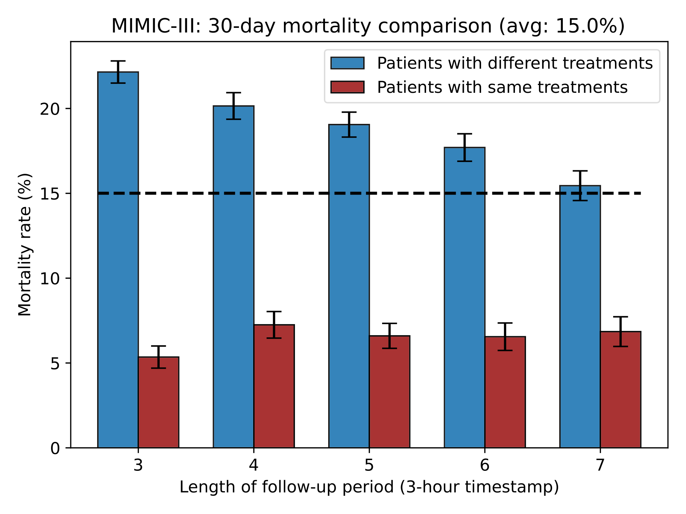
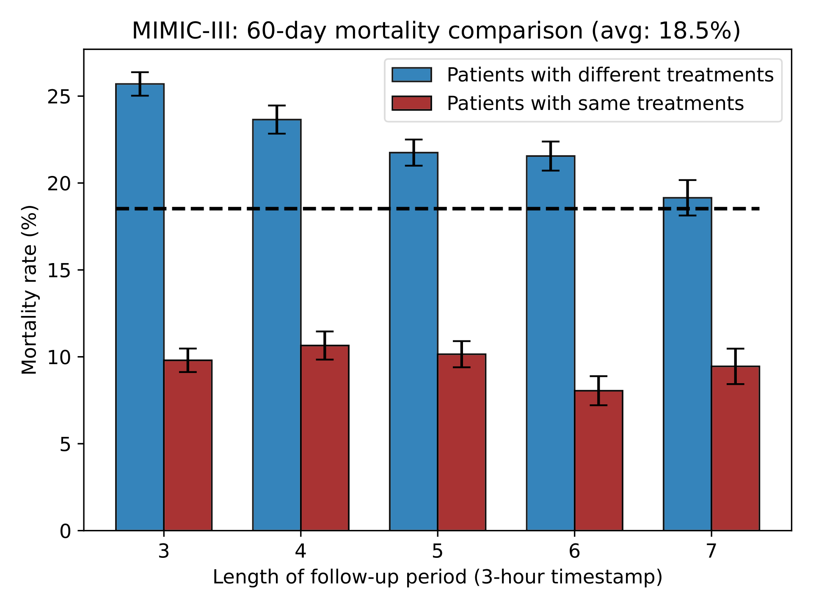
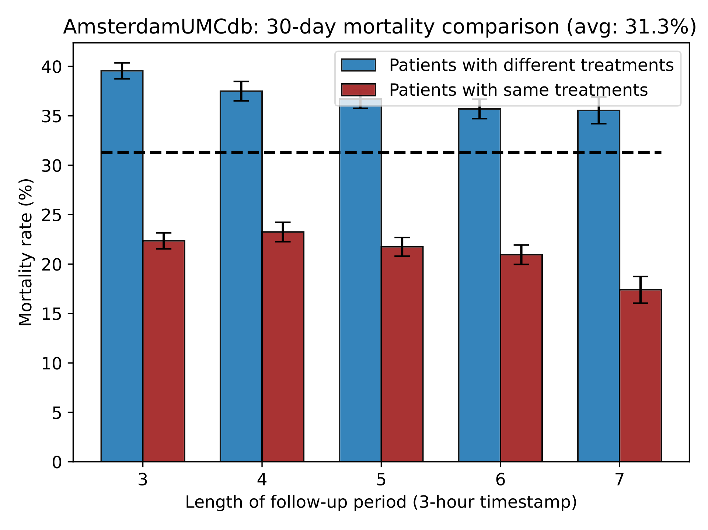
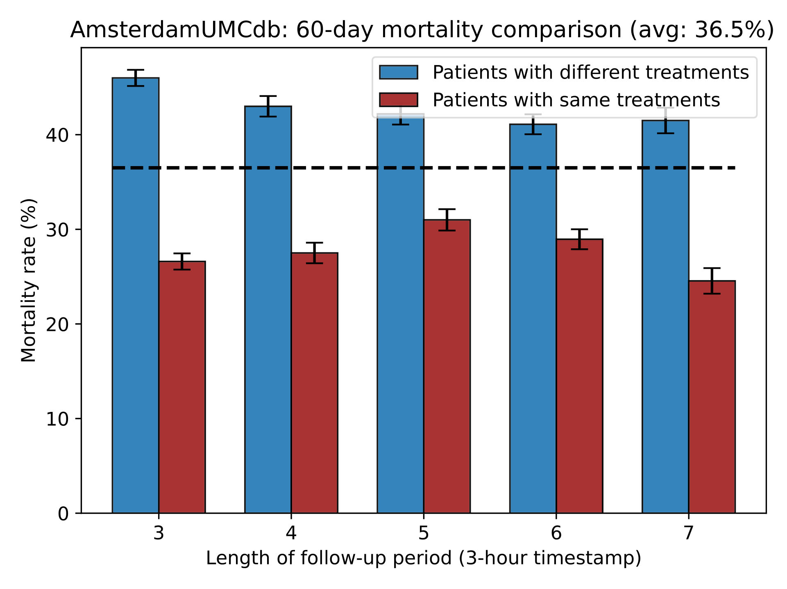

# T4

# Introduction
Code for paper "Estimating Trustworthy Treatment Effects for Antibiotic Stewardship in Sepsis"

 In this paper, we propose a novel method to estimate Trustworthy Treatment effects for Time-to-Treatment antibiotic stewardship in sepsis (T4). 
 
 

We demonstrate that T4 can identify effective treatment timing with estimated trustworthy ITEs for antibiotic stewardship on two real-world datasets ([AmsterdamUMCdb](https://amsterdammedicaldatascience.nl/) and [MIMIC-III](https://mimic.physionet.org/)).

# Requirement
Ubuntu16.04, python 3.6

Install [pytorch 1.4](https://pytorch.org/)

# Data
## Real-world data
#### Studied variables
The list of variables in MIMIC-III and AdmsterdamDB. There are 22 temporal covariates and 4 demographics andstatic variables. PT: Prothrombin Time; BUN: Blood Urea Nitrogen; WBC: White Blood Cells count.

| Category 	|  	| MIMIC-III 	|  	| AmsterdamDB 	|  	|
|---	|---	|---	|---	|---	|---	|
|  	|  	| Mean 	| Std. 	| Mean 	| Std. 	|
| Demographics 	| Age 	| 65.55 	| 16.44 	| 61.30 	| 17.90 	|
|  	| Gender 	| 43\% Female 	| - 	| 42\% Female 	| - 	|
|  	| Weight 	| 81.67 	| 25.50 	| 79.83 	| 13.61 	|
|  	| Height 	| 169.30 	| 11.17 	| 175.15 	| 8.44 	|
| Lab test 	| Anion gap 	| 13.35 	| 3.80 	| 8.70 	| 4.62 	|
|  	| Bicarbonate 	| 25.65 	| 5.27 	| 25.63 	| 6.35 	|
|  	| Bilirubin 	| 3.36 	| 6.41 	| 3.15 	| 6.85 	|
|  	| Creatinine 	| 1.50 	| 1.46 	| 1.28 	| 1.03 	|
|  	| Chloride 	| 104.00 	| 6.60 	| 108.60 	| 46.31 	|
|  	| Glucose 	| 134.00 	| 66.83 	| 133.9 	| 45.74 	|
|  	| Hematocrit 	| 29.96 	| 5.13 	| 38.98 	| 1.67 	|
|  	| Hemoglobin 	| 10.09 	| 1.79 	| 12.57 	| 1.64 	|
|  	| Lactate 	| 2.44 	| 2.14 	| 2.40 	| 2.95 	|
|  	| Platelet 	| 235.05 	| 155.28 	| 220.82 	| 171.65 	|
|  	| Potassium 	| 4.08 	| 0.63 	| 5.58 	| 602.56 	|
|  	| PT 	| 17.76 	| 8.95 	| 1.59 	| 10.12 	|
|  	| Sodium 	| 138.84 	| 5.32 	| 140.88 	| 43.45 	|
|  	| BUN 	| 29.85 	| 23.54 	| 14.15 	| 9.80 	|
|  	| WBC 	| 11.23 	| 7.64 	| 14.56 	| 11.80 	|
| Vital signs 	| Heart Rate 	| 87.81 	| 18.30 	| 92.70 	| 23.65 	|
|  	| SysBP 	| 120.92 	| 23.28 	| 126.05 	| 139.59 	|
|  	| DiasBP 	| 61.41 	| 14.55 	| 60.77 	| 31.11 	|
|  	| Meanbp 	| 78.70 	| 16.88 	| 82.12 	| 47.34 	|
|  	| Respratory 	| 20.48 	| 5.90 	| 21.99 	| 7.71 	|
|  	| Temperature 	| 36.96 	| 0.85 	| 36.73 	| 21.14 	|
|  	| SpO2 	| 97.00 	| 3.27 	| 96.09 	| 7.43 	|

#### Studied antibiotics
The list of antibiotics in MIMIC-III Dataset. There are 18 kinds of antibiotics in total.
| Category 	| Name 	|
|---	|---	|
| Antibiotic 	| Cefazolin, Cefepime, Ceftazidime, Ciprofloxacin, Clindamycin,  Erythromycin, Gentamicin, Levofloxacin, Metronidazole, Moxifloxacin, Piperacillin, Rifampin, Tobramycin, Vancomycin,  Amikacin, Ampicillin, Azithromycin, Aztreonam 	|

## Synthetic data
#### Fully synthetic data
```
mkdir -p data
python simulation/gen_synthetic.py
```

#### Semi-synthetic data based on MIMIC-III
```
# put preprocessed MIMIC-III data into folder "data/"
python simulation/gen_synthetic_mimic.py
```

# Train T4
#### Running example 
```
bash run.sh 3 # number of follow-up steps
```

# Results
Mortality rate comparison of two datasets. The results show that the mortality rate of patients who receive the antibiotics at the time werecommend is significantly lower than the patients who donot, indicating that our model offers effective timings of antibiotic administration that help to reduce the mortality rate.



